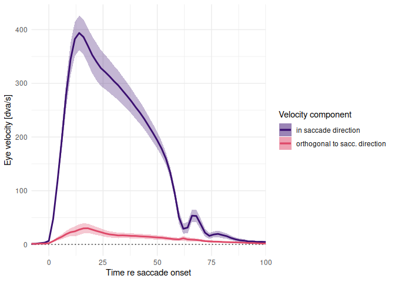
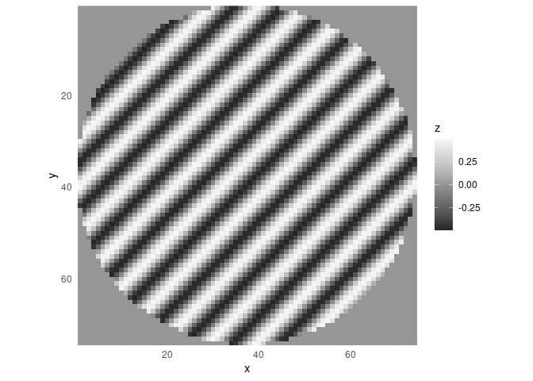

MotionSmearModeling
================
Richard Schweitzer
2023-03-01

This script shows how to apply the models described in the paper
**“Saccadic omission revisited: What saccade-induced smear looks like”**
by Richard Schweitzer, Mara Doering, Thomas Seel, Jörg Raisch, & Martin
Rolfs. Please refer to the manuscript for a detailed description of
models. If use any of the code below, please cite our paper as an
acknowledgement.

# Saccade data

We’ll need some saccade data. The large file “ISSP_sac_profiles.rda” can
be downloaded at: <https://osf.io/qya2m>

``` r
load("ISSP_sac_profiles.rda")
```

The packages we’ll need (and are not automatically loaded):

``` r
library(data.table)
library(ggplot2)
library(ggforce)
library(colorspace)
library(scales)
experiment_colorscale <- c('#1b9e77','#d95f02','#7570b3')
library(cowplot)
library(pracma)
```

Create the aggregates and have a look.

``` r
# aggregate to individual subjects
ISSP_sac_profiles_preagg <- ISSP_sac_profiles[!is.na(v) & 
                                                sac_t_relative <= 120 & sac_t_relative >= (-10), 
                                              .(v = mean(v),
                                                vs = mean(vs), 
                                                vx = mean(vx), 
                                                vy = mean(vy) ), 
                                              by = .(experiment_f, subj_id, sac_t_relative)]
ISSP_sac_profiles_agg <- ISSP_sac_profiles_preagg[ , 
                                            .(v = mean(v), 
                                              v_se = sd(v) / sqrt(length(v)), 
                                              vx = mean(vx), 
                                              vx_se = sd(vx) / sqrt(length(vx)), 
                                              vy = mean(vy), 
                                              vy_se = sd(vy) / sqrt(length(vy)) ), 
                                            by = .(experiment_f, sac_t_relative)]
# plot average saccade trajectories
p_sac_profiles <- ggplot(data = ISSP_sac_profiles_preagg, aes(x = sac_t_relative, y = v, 
                                                              color = experiment_f, 
                                                              group = paste(subj_id, experiment_f) )) + 
  geom_line(size = 0.5, alpha = 0.2) + 
  geom_line(data = ISSP_sac_profiles_agg, aes(x = sac_t_relative, y = v, 
                                              color = experiment_f, 
                                              group = experiment_f ), 
            size = 1.5, alpha = 0.9) + 
  geom_ribbon(data = ISSP_sac_profiles_agg, aes(x = sac_t_relative, y = v, 
                                                ymin = v - v_se, ymax = v + v_se,
                                                color = experiment_f, 
                                                group = experiment_f ),
              color = NA, alpha = 0.2) +
  coord_cartesian(expand = FALSE) + 
  scale_color_manual(values = experiment_colorscale) + 
  scale_fill_manual(values = experiment_colorscale) + 
  labs(x = "Time re saccade onset [ms]", y = "Eye velocity [dva/s]", 
       color = "Experiment", fill = "Experiment") + 
  theme_minimal(base_size = 15) + theme_minimal()
p_sac_profiles
```

<!-- -->

This is absolute velocity. Saccades usually have curvature, thus they
induce velocity components parallel and orthogonal to saccade direction.
Here we’ll normalize saccades in such a way that we can extract these
components…

``` r
# compute the mean saccades
ISSP_sac_profiles_subj_3 <- ISSP_sac_profiles[!is.na(vx) & !is.na(vy) & 
                                                sac_t_relative <= 100 & sac_t_relative >= (-10), 
                                              .(vx = mean(vx), 
                                                vy = mean(vy) ), 
                                              by = .(experiment, subj_id, sac_t_relative)]
ISSP_sac_profiles_subj_3 <- ISSP_sac_profiles_subj_3[order(experiment, subj_id, sac_t_relative)]
# get frame rate and determine position profile
issp_eye_track_sampling_rate <- median(diff(ISSP_sac_profiles_subj_3$sac_t_relative)) / 1000
ISSP_sac_profiles_subj_3[ , x := cumsum(vx*issp_eye_track_sampling_rate), 
                          by = .(experiment, subj_id)]
ISSP_sac_profiles_subj_3[ , y := cumsum(vy*issp_eye_track_sampling_rate), 
                          by = .(experiment, subj_id)]

# look at all these wild directions
ggplot(data = ISSP_sac_profiles_subj_3, 
       aes(x = x, y = y)) + 
  geom_path() + 
  facet_wrap(~experiment+subj_id) + 
  theme_minimal() + theme(strip.text = element_blank()) + 
  scale_color_viridis_c()
```

<!-- -->

``` r
# source our rotation function
source("rotate_re_start.R")

# perform the rotation
ISSP_sac_profiles_subj_3[ , c("x_rotated", "y_rotated", "sac_angle") := rotate_re_start(x, y), 
                          by = .(experiment, subj_id)]
```

    ## Loading required package: assertthat

``` r
# look at them all normalized
ggplot(data = ISSP_sac_profiles_subj_3, aes(x = x_rotated, y = y_rotated)) + 
  geom_path() + 
  #coord_fixed() + 
  facet_wrap(~experiment+subj_id) + 
  theme_minimal() + theme(strip.text = element_blank()) + 
  scale_color_viridis_c()
```

<!-- -->

``` r
# now compute parallel and orthogonal velocity components
ISSP_sac_profiles_subj_3[ , vx := c(NaN, diff(x)) / c(NaN, diff(sac_t_relative/1000)), 
                          by = .(experiment, subj_id)]
ISSP_sac_profiles_subj_3[ , vy := c(NaN, diff(y)) / c(NaN, diff(sac_t_relative/1000)), 
                          by = .(experiment, subj_id)]
# ... and aggregate across observers
ISSP_sac_profiles_3 <- ISSP_sac_profiles_subj_3[ , 
                                                 .(vx = mean(abs(vx), na.rm = TRUE), 
                                                   vx_se = sd(abs(vx), na.rm = TRUE) / 
                                                     sqrt(length(unique(subj_id))),
                                                   vy = mean(abs(vy), na.rm = TRUE), 
                                                   vy_se = sd(abs(vy), na.rm = TRUE) / 
                                                     sqrt(length(unique(subj_id))), 
                                                   x = mean(x), 
                                                   y = mean(y)), 
                                                 by = .(sac_t_relative)]

# have a look at the mean velocity profile:
p_vel_hor_vert_comp <- ggplot(ISSP_sac_profiles_3, aes(x = sac_t_relative, y = vx, 
                                                       color = "in saccade direction")) + 
  geom_hline(yintercept = 0, linetype = "dotted") + 
  geom_line(size = 2.5) + 
  geom_ribbon(aes(ymin = vx - 2*vx_se, ymax = vx + 2*vx_se, 
                  fill = "in saccade direction"), 
              alpha = 0.3, color = NA) + 
  geom_line(data = ISSP_sac_profiles_3, aes(x = sac_t_relative, y = vy, 
                                            color = "orthogonal to sacc. direction"), 
            size = 2.5) + 
  geom_ribbon(data = ISSP_sac_profiles_3, aes(ymin = vy - 2*vy_se, ymax = vy + 2*vy_se, 
                                              fill = "orthogonal to sacc. direction"), 
              alpha = 0.3, color = NA) + 
  theme_minimal() + theme(legend.position = "right", legend.direction = "vertical") + 
  scale_color_viridis_d(option = "magma", begin = 0.2, end = 0.6) +
  scale_fill_viridis_d(option = "magma", begin = 0.2, end = 0.6) +
  scale_x_continuous(expand = c(0,0), limits = c(-8, 100)) + 
  labs(x = "Time re saccade onset", y = "Eye velocity [dva/s]", 
       color = "Velocity component", fill = "Velocity component")
p_vel_hor_vert_comp  
```

    ## Warning: Removed 1 row(s) containing missing values (geom_path).
    ## Removed 1 row(s) containing missing values (geom_path).

<!-- -->

``` r
# we can remove the huge data.frame now, as we have the aggregated data:
rm(ISSP_sac_profiles)
```

Cool, now we have something to work with.

# The (extented) Kelly sensitivity model

D.H. Kelly did some amazing work on human contrast sensitivity, see:
*Kelly, D. H. (1979). Motion and vision. II. Stabilized spatio-temporal
threshold surface. Josa, 69(10), 1340-1349.*

Here we use his original function to replicate his results.

``` r
source("kelly_vel.R")

# replicate Figure 11 from Kelly 1979 
kelly_test <- data.table(expand.grid(list(SF = exp(seq(log(0.1), log(20), length.out = 100)), 
                                          #V = c(3, 32)
                                          V = c(0.125, 0.25, 0.5, 1, 2, 4, 8, 16, 32, 64, 128)
                                          )))
kelly_test[ , thres := kelly_vel(sf = SF, v = V)]
# ... and plot
ggplot(data = kelly_test, aes(x = SF, y = 1/thres, color = V, group = V)) + 
  geom_line() + 
  scale_x_continuous(trans = "log10", limits = c(0.1, 20)) + 
  scale_y_continuous(trans = trans_reverser("log10"), limits = c(1, 0.003), breaks = c(1, 0.1, 0.01)) + 
  scale_color_viridis_c() + 
  theme_minimal() + coord_cartesian(expand = FALSE) + 
  labs(x = "SF [cpd]", color = "Velocity [deg/s]", y = "Modulation")
```

    ## Warning: Removed 333 row(s) containing missing values (geom_path).

<!-- -->

``` r
# now replicate Kelly's Figure 13
kelly_test_2 <- data.table(expand.grid(list(SF = exp(seq(log(0.01), log(10), length.out = 10)), 
                                            TF = exp(seq(log(0.05), log(60), length.out = 100))   )))
kelly_test_2[ , sens := kelly_vel(sf = SF, v = TF/SF)]
kelly_test_2[ , thres := 1/sens]
# ... pretty plot
ggplot(data = kelly_test_2, 
       aes(x = TF, y = sens, color = SF, group = SF)) + 
  geom_line(size = 1, alpha = 0.7) + 
  scale_x_log10(limits = c(0.1, 60), expand = c(0,0)) + 
  scale_y_continuous(trans = "log10", breaks = c(0.1, 1, 10, 100), 
                     limits = c(0.1, 300),
                     expand = c(0,0)) + 
  annotation_logticks() + 
  scale_color_viridis_c(trans = "log10", option = "viridis") + 
  theme_minimal() + 
  labs(x = "Temporal frequency [Hz]", y = "Contrast sensitivity (Kelly, 1979)", 
       color = "Spatial\nfrequency [cpd]")
```

    ## Warning: Removed 162 row(s) containing missing values (geom_path).

<!-- -->

Now we’ll use the extended Kelly model to predict contrast sensitivity
to orientations relative to the direction of the saccade.

``` r
# relevant function:
source("kelly_sens_ori_vel_sf.R")

# choose ranges of SFs and Orientations
SFs <- exp(seq(log(0.01), log(10), length.out = 110))
Oris <- seq(-90, 90, length.out = 110)
SFs_Oris <- data.table(expand.grid(SF = SFs, Ori = Oris))

# run the extended Kelly model to predict contrast sensitivity for each time point
intra_sac_sensitivities <- NULL
for (row_i in 2:nrow(ISSP_sac_profiles_3)) {
  vx_now <- ISSP_sac_profiles_3$vx[row_i]
  vy_now <- ISSP_sac_profiles_3$vy[row_i]
  dt_now <- copy(SFs_Oris)
  dt_now[ , sac_t := ISSP_sac_profiles_3$sac_t_relative[row_i]]
  dt_now[ , vx := vx_now]
  dt_now[ , vy := vy_now]
  dt_now[ , v := sqrt(vx^2 + vy^2)]
  dt_now[ , final_gabor_vel := kelly_sens_ori_vel_sf(gabor_ori = Ori, gabor_sf = SF, 
                                          global_dir = 90, 
                                          global_vel = vx_now, global_orth_vel = vy_now, 
                                          return_final_vel = TRUE)]
  dt_now[ , final_gabor_tf := final_gabor_vel * SF]
  dt_now[ , sens := kelly_sens_ori_vel_sf(gabor_ori = Ori, gabor_sf = SF, 
                                          global_dir = 90, 
                                          global_vel = vx_now, global_orth_vel = vy_now, 
                                          return_final_vel = FALSE)]
  intra_sac_sensitivities <- rbind(intra_sac_sensitivities, dt_now)
}
intra_sac_sensitivities[ , SF_f := ordered(SF)]

# look at the resulting sensitivities
what_timepoints <- c(-6, 2, 10, 30, 50, 60, 80, 100)
p_sens_over_time <- ggplot(intra_sac_sensitivities[is.element(sac_t, what_timepoints)], 
                           aes(x = Ori, y = SF, fill = (sens) )) + 
  coord_cartesian(expand = FALSE) + 
  scale_y_log10() + 
  geom_raster(interpolate = TRUE) + 
  facet_wrap(~sac_t, nrow = 2) + 
  theme_minimal() + 
  scale_x_continuous(breaks = c(-90, -45, 0, 45, 90), expand = c(0,0)) + 
  scale_fill_continuous_diverging(palette = "Blue-Red 3", rev = TRUE) + 
  labs(x = "Relative orientation", y = "Spatial frequency [cpd]", 
       fill = "Contrast sensitivity")
p_sens_over_time 
```

<!-- -->

# Gabor filters

First, we’ll test the Gabor filter function:

``` r
source("plot_heatmap.R") # to plot 2D matrices with ggplot2
source("get_gabor_field.R") # creates a Gabor filter


# random parameters
scr.ppd <- 36.7362 # pixels per degree
V1_timescale <- 1000/(120*100) # duration of a single sample in our model

# a grating in circular aperture
gabor_pair <- get_gabor_field(rf_freq_dva = 5, rf_ori = pi/4, rf_width_dva = 2,
                              scr.ppd = scr.ppd, gaussian_aperture = FALSE)
gabor_pair[[3]]
```

    ##     rf_freq_dva    rf_width_dva        rf_width   rf_mesh_width          rf_ori 
    ##       5.0000000       2.0000000      73.4724000     220.4172000       0.7853982 
    ##         scr.ppd      ppd_scaler mesh_resolution 
    ##      36.7362000       1.0000000       1.0000000

``` r
plot_heatmap(gabor_pair[[2]])
```

    ## Loading required package: reshape2

    ## 
    ## Attaching package: 'reshape2'

    ## The following objects are masked from 'package:data.table':
    ## 
    ##     dcast, melt

    ## Loading required package: viridis

    ## Loading required package: viridisLite

    ## 
    ## Attaching package: 'viridis'

    ## The following object is masked from 'package:scales':
    ## 
    ##     viridis_pal

<!-- -->

``` r
# a grating in a Gaussian aperture
gabor_pair_gauss <- get_gabor_field(rf_freq_dva = 5, rf_ori = pi/4, rf_width_dva = 2,
                                    scr.ppd = scr.ppd, gaussian_aperture = TRUE)
gabor_pair_gauss[[3]]
```

    ##     rf_freq_dva    rf_width_dva        rf_width   rf_mesh_width          rf_ori 
    ##       5.0000000       2.0000000      73.4724000     220.4172000       0.7853982 
    ##         scr.ppd      ppd_scaler mesh_resolution 
    ##      36.7362000       1.0000000       1.0000000

``` r
plot_heatmap(gabor_pair_gauss[[2]])
```

<!-- -->

Nice, that works, let’s have a look at the frequency-orientation
spectrum. We should expect high power at 5 cpd and 45 degrees.

``` r
source("get_fft2.R") # gets us the two-dimensional FFT2 of an image

# get fft of the Gabor created above in Ori-SF space
test_fft_1 <- get_fft2(stim_image_gray = gabor_pair_gauss[[2]], 
                     scr.ppd = scr.ppd)[[1]]
```

    ## Loading required package: gsignal

    ## 
    ## Attaching package: 'gsignal'

    ## The following objects are masked from 'package:pracma':
    ## 
    ##     conv, detrend, fftshift, findpeaks, ifft, ifftshift

    ## The following objects are masked from 'package:stats':
    ## 
    ##     filter, gaussian, poly

    ## Loading required package: fields

    ## Loading required package: spam

    ## Spam version 2.9-1 (2022-08-07) is loaded.
    ## Type 'help( Spam)' or 'demo( spam)' for a short introduction 
    ## and overview of this package.
    ## Help for individual functions is also obtained by adding the
    ## suffix '.spam' to the function name, e.g. 'help( chol.spam)'.

    ## 
    ## Attaching package: 'spam'

    ## The following objects are masked from 'package:base':
    ## 
    ##     backsolve, forwardsolve

    ## 
    ## Try help(fields) to get started.

``` r
ggplot(test_fft_1, aes(x = rf_ori, y = rf_freq_dva, color = (power))) + 
  geom_point() + theme_minimal() + coord_cartesian(expand = FALSE)
```

<!-- -->

``` r
# ... try the more common FFT2 representation:
test_fft_2 <- get_fft2(stim_image_gray = gabor_pair_gauss[[2]], 
                     scr.ppd = scr.ppd)[[4]]
plot_heatmap(test_fft_2)
```

<!-- -->

… seems like this is all as intended.

# The single-RF model

Consider a single simple-cell RF, modeled as a Gabor filter, being swept
across the scene during a saccade. Below we’ll produce a bank of Gabor
filters and look at the induced temporal frequencies as they move across
the scene.

First we’ll load a random image (photo credits: Richard Schweitzer) and
convert it to grayscale. Useful source:
<https://stackoverflow.com/questions/31800687/how-to-get-a-pixel-matrix-from-grayscale-image-in-r>

``` r
library(jpeg) # to read JPG files
library(assertthat) # well, to assert things

# read the image presented in the trial
stim_image <- readJPEG("example_image.jpg")
# convert to grayscale
stim_image_hex <- rgb(stim_image[,,1], stim_image[,,2], stim_image[,,3]) # hexadecimal color space
stim_image_hex_gray <- desaturate(stim_image_hex) # grayscale hexadecimal color space
stim_image_gray <- col2rgb(stim_image_hex_gray)[1, ]/255 # converted back to 0..1 colorspace
dim(stim_image_gray) <- dim(stim_image_hex) <- dim(stim_image_hex_gray) <- dim(stim_image)[1:2]
# trim the image to fullHD resolution
stim_image_pres_offset <- ceiling((dim(stim_image_gray) - c(1080, 1920)) / 2) # we will trim to this
# delete the old versions of the image
rm(stim_image, stim_image_hex, stim_image_hex_gray)
# pick the presented portion of the image
stim_image_gray <- stim_image_gray[stim_image_pres_offset[1]:(stim_image_pres_offset[1]+1080-1), 
                                   stim_image_pres_offset[2]:(stim_image_pres_offset[2]+1920-1)]
assert_that(all(dim(stim_image_gray)==c(1080, 1920)))
```

    ## [1] TRUE

``` r
# give the image matrix proper dimnames
rows_stim_image_gray = 1:nrow(stim_image_gray)
cols_stim_image_gray = 1:ncol(stim_image_gray)
dimnames(stim_image_gray) <- list(rows_stim_image_gray, cols_stim_image_gray)
# show the result:
plot_heatmap(stim_image_gray)
```

<!-- -->

Lovely.

Now let’s use the average saccade trajectory to simulate a saccade
across this image.

``` r
# some random parameters relating to the time when the display is on
t_display_onset <- 9
t_stimulus_duration <- 5 * 1000/120 # we may pick a long stimulus duration to cover the entire saccade
xy_start <- c(600, 540) # arbitrary starting position of the saccade

# get relevant subportion of the saccade trajectory
sac <- ISSP_sac_profiles_3[sac_t_relative>=t_display_onset &
                               sac_t_relative<=(t_display_onset+t_stimulus_duration)]

# upsample to V1_timescale
sac_fun_x <- approxfun(sac$sac_t_relative, xy_start[1]+sac$x*scr.ppd)
sac_fun_y <- approxfun(sac$sac_t_relative, xy_start[2]+sac$y*scr.ppd)
pres_timestamps <- seq(from = min(sac$sac_t_relative), 
                       to = max(sac$sac_t_relative), 
                       by = V1_timescale)
eye_pos <- data.table(sac_t_raw = pres_timestamps, 
                      sac_x_raw = sac_fun_x(pres_timestamps), sac_y_raw = sac_fun_y(pres_timestamps), 
                      sample_index = 1:length(pres_timestamps))

# plot image and saccade trajectory here:
p_stim <- plot_heatmap(stim_image_gray[100:900, 400:1500], do_print = FALSE, do_rasterize = TRUE)
```

    ## Loading required package: ggrastr

``` r
p_stim <- p_stim + 
  geom_point(data = eye_pos, aes(x = sac_x_raw, y = sac_y_raw, fill = NA, 
                                 color = sac_t_raw), 
             fill = "black", size = 2.5, alpha = 0.5) + 
  scale_color_viridis_c(option = "mako", begin = 0, end = 0.6) + 
  labs(x = "X [pix]", y = "Y [pix]", fill = "I", color = "Time re\nsaccade\nonset [ms]") +
  #scale_y_reverse(limits = c(750, 250)) + scale_x_continuous(limits = c(400, 1200)) + 
  guides(fill="none")
p_stim 
```

<!-- -->

Now we can generate a bank of Gabor filters.

``` r
source("get_gabor_filter_bank.R")

# get current saccade direction
current_sac_dir <- atan2(ISSP_sac_profiles_3[sac_t_relative==100, y]-
                           ISSP_sac_profiles_3[sac_t_relative==0, y], 
                         ISSP_sac_profiles_3[sac_t_relative==100, x]-
                           ISSP_sac_profiles_3[sac_t_relative==0, x])*180/pi 
if (current_sac_dir > 180) {
  current_sac_dir <- current_sac_dir - 360
}
current_sac_dir_rad <- deg2rad(current_sac_dir) # 0: perfectly horizontal, >0: clockwise
# what orientations shall we use?
current_oris <- current_sac_dir_rad + seq(0, pi/2, length.out = 3)
current_sfs <- c(0.5, 1, 2)
# create list of Gabor filters
gabor_list <- get_gabor_filter_bank(
  all_SF = current_sfs, 
  all_Ori = current_oris, # positive means clockwise
  rf_width_override = 3, # cpd, set to NaN to let the function determine RF field size
  scr_ppd = scr.ppd, 
  ppd_scaler = 1,
  make_gaussian_aperture = TRUE)
# plot all these Gabors
p_gabor_list <- vector(mode = "list")
for (gi in 1:length(gabor_list)) {
  p_gabor_list[[gi]] <- plot_heatmap(mat = gabor_list[[gi]][[2]], do_print = FALSE) + 
    theme(legend.position = "none")
}
plot_grid(plotlist = p_gabor_list, nrow = length(current_sfs))
```

<!-- -->

Nice, now we can simulate the luminance modulations they would respond
to as they are shifted across the scene.

``` r
#source("extract_target_image.R") # not needed here
source("get_gabor_filter_resp.R") # computes the dot product
source("run_bank_of_gabor_filters.R") # runs through all Gabor filters
require(foreach)
```

    ## Loading required package: foreach

``` r
single_trial_responses <- foreach(eyepos_i = 1:nrow(eye_pos), 
                                  .verbose = FALSE, .errorhandling = "stop", 
                                  .combine = 'rbind' ) %do% {
                                    # run the function given the current eye position
                                    # (RF has zero eccentricity)
                                    resp <- run_bank_of_gabor_filters(
                                      eyepos_x = eye_pos$sac_x_raw[eyepos_i], 
                                      eyepos_y = eye_pos$sac_y_raw[eyepos_i],
                                      rf_ecc_x = 0,
                                      rf_ecc_y = 0,
                                      gabor_list = gabor_list, 
                                      normalize_brightness = TRUE, 
                                      normalize_size = TRUE, 
                                      stim_image = stim_image_gray, 
                                      stim_image_midpoint = 0.5, 
                                      do_plot = FALSE)
                                    resp$sac_t_onset <- eye_pos$sac_t_raw[eyepos_i]
                                    # return the results
                                    return(resp)
                                  }
single_trial_responses[ , resp_both := (resp_zero+resp_half)/2]
# order
single_trial_responses <- single_trial_responses[order(rf_freq_dva, rf_ori, sac_t_onset)]

# plot single responses over time
single_trial_responses[ , rf_freq_dva_of := ordered(round(rf_freq_dva, 2), 
                                                    levels = sort(unique(round(rf_freq_dva, 2)), 
                                                                  decreasing = FALSE))]
p_single_trial_responses <- ggplot(single_trial_responses, 
                                   aes(x = sac_t_onset, y = resp_both, # 
                                       color = rf_freq_dva_of, group = rf_freq_dva_of)) + 
  geom_hline(yintercept = 0, linetype = "dotted") + 
  geom_line(size = 1.5, alpha = 0.8) + 
  facet_wrap(~round(rf_ori, 2), nrow = 1) + 
  theme_minimal() + 
  scale_color_viridis_d() + 
  labs(x = "Time re saccade offset [ms]", y = "Luminance modulation in RF [a.u.]", 
       color = "Spatial\nfrequency\n[cpd]")
p_single_trial_responses
```

<!-- -->

What is the temporal frequency content of this?

``` r
source("compute_PSD.R")

# number of samples we have available
n_FT_samples <- length(unique(single_trial_responses$sac_t_onset))
# the TFs we want:
return_these_temp_freqs <- exp(linspace(log(1), log(6000), 300))
# do we have responses for each SF?
table(!is.na(single_trial_responses$resp_half), single_trial_responses$rf_freq_dva) 
```

    ##       
    ##         0.5    1    2
    ##   TRUE 1443 1443 1443

``` r
# cool, then run the spectral density
FT_res <- single_trial_responses[ , 
                                  c(compute_PSD(time_ms = sac_t_onset, 
                                                signal = resp_both,  # example plot done with resp_zero
                                                return_these_freq = return_these_temp_freqs, # example plot done with c()
                                                pad_n_zeros = 5000-n_FT_samples, # standard was with 1000-n_FT_samples
                                                use_method = "multitaper"
                                  )), 
                                  by = .(rf_freq_dva, rf_ori)]
```

    ## Loading required package: multitaper

``` r
# plot the result
p_FT_res <- ggplot(FT_res, aes(x = tfreq, y = PSD, color = as.factor(round(rf_freq_dva, 2) ))) + 
  geom_line(size = 1.5, alpha = 0.8) + 
  facet_wrap(~round(rf_ori, 2)) + scale_color_viridis_d() + 
  scale_y_log10(breaks = trans_breaks("log10", function(x) 10^x), 
                labels = trans_format("log10", math_format(10^.x))) + 
  scale_x_log10(limits = c(min(return_these_temp_freqs), max(return_these_temp_freqs))) + 
  theme_minimal() + 
  labs(x = "Temporal frequency [Hz]", y = "Spectral power", color = "Spatial\nfrequency\n[cpd]")
p_FT_res
```

<!-- -->

Indeed, we see the expected peaks at the temporal frequencies we’d
expect.

# Smear as a motion filter

What’s difference between a linear motion filter and the proposed
trajectory-dependent motion filters? Here we elucidate.

``` r
source("motion_filt.R") # linear motion filter
source("motion_filt_from_xy.R") # trajectory-dependent motion filter

# example 1: dynamic motion filter
dyna_motion_filt <- motion_filt_from_xy(x_pos = eye_pos$sac_x_raw, 
                                        y_pos = eye_pos$sac_y_raw, 
                                        w_pos = NULL, 
                                        center_around_ith_pos = 250)
# aesthetic cropping:
dyna_motion_filt <- dyna_motion_filt[30:(nrow(dyna_motion_filt)-20), 
                                     60:(ncol(dyna_motion_filt)-70)] 
dimnames(dyna_motion_filt) <- NULL

# example 2: linear motion filter
normal_motion_filt <- dyna_motion_filt
normal_motion_filt[ , ] <- 0
normal_motion_filt_temp <- motion_filt(filter_len = 12*scr.ppd, filter_ang = 2)
normal_motion_filt[
  round(nrow(normal_motion_filt)/2-nrow(normal_motion_filt_temp)/2):round(nrow(normal_motion_filt)/2+nrow(normal_motion_filt_temp)/2), 
  
  round(ncol(normal_motion_filt)/2-ncol(normal_motion_filt_temp)/2):round(ncol(normal_motion_filt)/2+ncol(normal_motion_filt_temp)/2)] <-
  normal_motion_filt_temp

# plot them...
# ... dynamic
p_dyna_motion_filt <- plot_heatmap(dyna_motion_filt)
p_dyna_motion_filt <- p_dyna_motion_filt + 
  scale_fill_distiller(type = "seq",
                       direction = 1,
                       palette = "Greys", 
                       limits = c(min(c(dyna_motion_filt, normal_motion_filt)), 
                                  max(c(dyna_motion_filt, normal_motion_filt)))) + 
  coord_cartesian(expand = FALSE)
```

    ## Scale for 'fill' is already present. Adding another scale for 'fill', which
    ## will replace the existing scale.

    ## Coordinate system already present. Adding new coordinate system, which will replace the existing one.

``` r
# ... normal
p_normal_motion_filt <- plot_heatmap(normal_motion_filt)
p_normal_motion_filt <- p_normal_motion_filt + 
  scale_fill_distiller(type = "seq",
                       direction = 1,
                       palette = "Greys", 
                       limits = c(min(c(dyna_motion_filt, normal_motion_filt)), 
                                  max(c(dyna_motion_filt, normal_motion_filt)))) + 
  coord_cartesian(expand = FALSE)
```

    ## Scale for 'fill' is already present. Adding another scale for 'fill', which
    ## will replace the existing scale.
    ## Coordinate system already present. Adding new coordinate system, which will replace the existing one.

``` r
# ... and combine:
p_motion_filters <- plot_grid(p_normal_motion_filt, p_dyna_motion_filt, 
                              nrow = 2, align = "hv", axis = "tblr")
p_motion_filters
```

<!-- -->

This might be a bit clearer if we show what results look like, after
we’ve used them convolutions.

``` r
require(smoothie) # for convolutions
```

    ## Loading required package: smoothie

``` r
# linear motion filter
im_filtered_1 <- kernel2dsmooth(x = stim_image_gray, 
                                K = normal_motion_filt)
p_im_filtered_1 <- plot_heatmap(mat = im_filtered_1, do_rasterize = TRUE)
p_im_filtered_1 <- p_im_filtered_1 + ggtitle("linear") + 
  theme(axis.title = element_blank(), axis.text = element_blank(), legend.position = "none")

# trajectory-dependent motion filter
im_filtered_2 <- kernel2dsmooth(x = stim_image_gray, 
                                K = dyna_motion_filt)
p_im_filtered_2 <- plot_heatmap(mat = im_filtered_2, do_rasterize = TRUE)
p_im_filtered_2 <- p_im_filtered_2 + ggtitle("trajectory-dependent") + 
  theme(axis.title = element_blank(), axis.text = element_blank(), legend.position = "none")

# plot them alongside each other
plot_grid(p_im_filtered_1, p_im_filtered_2, nrow = 1)
```

<!-- -->

Not a huge difference, but for this example we haven’t used temporal
weights yet. Let’s briefly elaborate on the concept of those weights
here:

``` r
source("motion_filt_weights_from_t.R") # temporal weights for trajectory-dependent filter

# plot some IRFs
irf_delays <- c(0, 10, 20, 30, 40, 50, 60, 70) # delays of stimuli
d_irf <- NULL
# go through reverse order of delays, as the most recent is always the max
for (irf_delay_now in rev(irf_delays) ) {
  ti <- seq(0, 200) # overall duration of sequence
  constant_delay <- 5 # a constant delay, arbitrary really
  # compute gamma-shaped temporal response function here
  irf_i <- gamma_special(x = ti, latency = irf_delay_now+constant_delay, 
                         norm_amp = 1, 
                         shape = 1.72, scale = 20.94)
  dt <- data.table(time = ti, irf = irf_i, irf_delay = irf_delay_now)
  # determine the time point of the maximum weight
  if (irf_delay_now==max(irf_delays)) {
    when_max <- dt$time[dt$irf==max(dt$irf)]
  }
  dt[ , when_max := when_max]
  # determine value of the TRF at the time of the maximum weight
  dt[ , irf_when_max := irf[time==when_max]]
  # add
  d_irf <- rbind(d_irf, dt)
}
d_irf[ , irf_delay_f := ordered(irf_delay)]

# plot results of this simulation 
p_irf <- ggplot(d_irf, aes(x = time, y = irf, color = irf_delay_f)) + 
  coord_cartesian(expand = FALSE, ylim = c(0,1.025)) + 
  geom_line(size = 1) + 
  geom_vline(aes(xintercept = when_max), linetype = "dotted", alpha = 1, size = 1.2, color = "black") + 
  geom_point(size = 3, aes(x = when_max, y = irf_when_max, color = irf_delay_f)) + 
  theme_minimal() + theme(legend.direction = "vertical", legend.position = "bottom") + 
  guides(col = guide_legend(nrow = 2, byrow = TRUE)) + 
  scale_color_viridis_d(option = "mako", end = 0.9) + 
  labs(x = "Time re stimulus onset [ms]", y = "Response", color = "Onset asynchrony [ms]")
p_irf
```

<!-- -->

The weights are the fat dots aligned on top of the dotted vertical line.

Now let’s see whether we can apply those temporal weights to make model
predictions for different display durations to create a masking time
course.

``` r
# display durations to test
test_these_stim_dur_ms <- seq(1000/120, 10*1000/120, 1000/120)
round(test_these_stim_dur_ms, 2)
```

    ##  [1]  8.33 16.67 25.00 33.33 41.67 50.00 58.33 66.67 75.00 83.33

``` r
# for that, let's re-do the eye_pos data frame to cover the entire saccade duration
sac_fun_x <- approxfun(ISSP_sac_profiles_3$sac_t_relative, 
                       xy_start[1]+ISSP_sac_profiles_3$x*scr.ppd)
sac_fun_y <- approxfun(ISSP_sac_profiles_3$sac_t_relative, 
                       xy_start[2]+ISSP_sac_profiles_3$y*scr.ppd)
pres_timestamps_2 <- seq(from = t_display_onset, 
                         to = t_display_onset + ceil(max(test_these_stim_dur_ms)), 
                         by = 1000 / 12000)
eye_pos_2 <- data.table(sac_t_raw = pres_timestamps_2, 
                        sac_t_onset = pres_timestamps_2 - t_display_onset,
                        sac_x_raw = sac_fun_x(pres_timestamps_2), 
                        sac_y_raw = sac_fun_y(pres_timestamps_2), 
                        sample_index = 1:length(pres_timestamps_2))


# (not preallocate and) 
illustrate_motion_filters <- vector(mode = "list", length = length(test_these_stim_dur_ms))
illustrate_motion_filters_i <- 0
for (stim_dur_ms_now in sort(test_these_stim_dur_ms)) {
  # select relevant time points
  eye_pos_now <- eye_pos_2[sac_t_onset <= stim_dur_ms_now, ]
  # compute temporal weights
  eye_pos_now[ , w := motion_filt_weights_from_t(t_ms = eye_pos_now$sac_t_onset)]
  # create filter
  filter_now <- motion_filt_from_xy(x_pos = eye_pos_now$sac_x_raw, 
                                    y_pos = eye_pos_now$sac_y_raw, 
                                    w_pos = eye_pos_now$w)
  # show filter
  p_filter_now <- plot_heatmap(filter_now)
  p_filter_now <- p_filter_now + ggtitle(paste0("Filter kernel at display dur: ", 
                                                round(stim_dur_ms_now, 2))) + 
    scale_fill_viridis(trans = "log10", 
                       breaks = trans_breaks("log10", function(x) 10^x), 
                       labels = trans_format("log10", math_format(10^.x))) + 
    coord_fixed(ratio = 4, expand = FALSE)
  suppressWarnings(print(p_filter_now)) # there will be warnings due to log10 of 0
  # perform convolution
  im_filtered_now <- kernel2dsmooth(x = stim_image_gray-0.5, 
                                    K = filter_now)+0.5
  # ... and plot
  p_now <- plot_heatmap(mat = im_filtered_now, do_rasterize = TRUE)
  p_now <- p_now + theme(axis.title = element_blank(), axis.text = element_blank(), 
                         legend.position = "none") + 
    ggtitle(paste0("display dur: ", round(stim_dur_ms_now, 2)))
  illustrate_motion_filters_i <- illustrate_motion_filters_i + 1
  illustrate_motion_filters[[illustrate_motion_filters_i]] <- p_now
}
```

<!-- --><!-- --><!-- --><!-- --><!-- --><!-- --><!-- --><!-- --><!-- --><!-- -->

``` r
# combine all results
p_illustrate_motion_filters <- plot_grid(plotlist = illustrate_motion_filters, 
                                         nrow = 3, align = "hv", axis = "tblr")
p_illustrate_motion_filters 
```

<!-- -->

``` r
rm(illustrate_motion_filters) # save working memory
```

Indeed, a masking time course.

# Saccadic suppression

Finally, showcase the suppression function. For details on how it was
fit, please refer to the manuscript. Suitable parameters are already set
as defaults.

``` r
source("suppression_fun.R")

# create a time-SF space
suppression_test <- data.table(
  expand.grid(rf_freq_dva = exp(seq(log(0.01), log(5), length.out = 100)), 
              time_re_sac_onset = seq(-230, 230, by = 1)))

# use the suppression model to predict suppression strength
suppression_test[ , suppression_predict := suppression_fun(baseline_sens = NaN, 
                                                           time = time_re_sac_onset, 
                                                           sf = rf_freq_dva) ]
# now plot the result
p_suppression <- ggplot(data = suppression_test, aes(x = time_re_sac_onset, 
                                    y = rf_freq_dva, 
                                    fill = 1/suppression_predict)) + 
  coord_cartesian(expand = FALSE) + 
  geom_raster(interpolate = TRUE) + 
  annotation_logticks(sides = "l") + 
  theme_minimal() + scale_y_log10() + 
  scale_fill_viridis_c(option = "plasma", trans = "log10",
                         direction = 1) + 
  labs(x = "Time re saccade onset [ms]", y = "Spatial frequency [cpd]", 
       fill = "Saccadic\nsuppression\nfactor", color = "Saccadic\nsuppression\nfactor")
p_suppression 
```

<!-- -->

Finally, test saccadic suppression on Kelly-based contrast sensitivity?

``` r
# now see how this impacts the Kelly surface we computed above
time_now <- 7 # XX msec after saccade onset
kelly_test_2[ , suppress_fac := suppression_fun(sf = SF, time = time_now)]
kelly_test_2[ , sens_suppressed := sens * suppress_fac]

## plot here: TF dimension
# 1. normal
p_kelly_normal_1 <- ggplot(data = kelly_test_2, 
                               aes(x = TF, y = sens, color = SF, group = SF)) + 
  geom_line() + 
  scale_x_log10(limits = c(0.1, 60), expand = c(0,0)) + 
  scale_y_continuous(trans = "log10", limits = c(0.1, 300), breaks = c(0.1, 1, 10, 100), 
                     expand = c(0,0)) + 
  annotation_logticks() + 
  scale_color_viridis_c(trans = "log10", option = "viridis") + 
  theme_minimal() + theme(legend.position = "bottom", legend.direction = "horizontal") + 
  labs(x = "Temporal frequency [Hz]", y = "Sensitivity", color = "Spatial\nfrequency [cpd]", 
       title = "SF-TF surface - normal")
# 2. suppressed
p_kelly_suppressed_1 <- ggplot(data = kelly_test_2, 
                               aes(x = TF, y = sens_suppressed, color = SF, group = SF)) + 
  geom_line() + 
  scale_x_log10(limits = c(0.1, 60), expand = c(0,0)) + 
  scale_y_continuous(trans = "log10", limits = c(0.1, 300), breaks = c(0.1, 1, 10, 100), 
                     expand = c(0,0)) + 
  annotation_logticks() + 
  scale_color_viridis_c(trans = "log10", option = "viridis") + 
  theme_minimal() + theme(legend.position = "bottom", legend.direction = "horizontal") + 
  labs(x = "Temporal frequency [Hz]", y = "Sensitivity", color = "Spatial\nfrequency [cpd]", 
       title = "SF-TF surface - suppressed")
# --> combined
plot_grid(p_kelly_normal_1, p_kelly_suppressed_1, nrow = 1)
```

    ## Warning: Removed 162 row(s) containing missing values (geom_path).

    ## Warning: Removed 210 row(s) containing missing values (geom_path).

<!-- -->

``` r
## plot here: SF dimension
kelly_test_2[ , TF_f := ordered(round(TF, 1))]
kelly_test_2[ , TF_subset := is.element(TF, unique(kelly_test_2$TF)[c(11, 50, 80, 90)])]
# here you go:
p_kelly_suppressed <- ggplot(data = kelly_test_2[TF_subset==TRUE], 
       aes(x = SF, y = sens, color = TF_f, group = TF_f)) + 
  geom_line(aes(alpha = "during fixation"), size = 1) + 
  geom_ribbon(aes(ymax = sens, ymin = sens_suppressed, fill = TF_f), color = NA, alpha = 0.1) + 
  geom_line(data = kelly_test_2[TF_subset==TRUE], 
       aes(x = SF, y = sens_suppressed, color = TF_f, group = TF_f, alpha = "saccadic suppression"), size = 1.5) +
  scale_x_log10(limits = c(0.1, 10), expand = c(0,0)) + 
  scale_y_continuous(trans = "log10", limits = c(0.1, 300), breaks = c(0.1, 1, 10, 100), 
                     expand = c(0,0)) + 
  annotation_logticks() + 
  scale_color_viridis_d(option = "rocket", end = 0.8) + 
  scale_fill_viridis_d(option = "rocket", end = 0.8) + 
  scale_alpha_manual(values = c(0.3, 1)) + 
  theme_minimal() + 
  labs(x = "Spatial frequency [cpd]", y = "Contrast sensitivity\n(Kelly, 1979)", 
       color = "Temporal\nfrequency [Hz]", fill = "Temporal\nfrequency [Hz]", 
       alpha = "Sensitivity")
p_kelly_suppressed
```

    ## Warning: Removed 13 row(s) containing missing values (geom_path).

    ## Warning: Removed 12 row(s) containing missing values (geom_path).

<!-- -->

The shaded area indicates the area falling prey to saccadic suppression.
